# AI Interviewer - Project Analysis & Replication Guide

This document provides a comprehensive analysis of the **AI Interviewer** project. It details the architecture, the technology stack, the exact workflow of how it works under the hood, and provides a guide on how you can build a similar project from scratch.

---

## 🛠️ Technology Stack

The project is structured as a TypeScript **monorepo** utilizing the following core technologies:

### 1. Monorepo & Build Tooling
*   **Package Manager:** [Bun](https://bun.sh/) (version `1.3.11`) - used for installing dependencies, running workspaces, and acting as the JS runtime.
*   **Orchestration:** [Turborepo](https://turbo.build/) - manages the workspace commands (`build`, `dev`, `lint`) across apps and shared packages.
*   **Workspaces:**
    *   `apps/frontend` (React web app)
    *   `apps/backend` (Express server & database layer)
    *   `packages/` (Shared configuration packages: `eslint-config`, `typescript-config`, `ui`)

### 2. Frontend Application (`apps/frontend`)
*   **Framework:** React 19 with client-side routing via [React Router v7](https://reactrouter.com/).
*   **Server/Router:** Runs on Bun's built-in HTTP server (`Bun.serve`) with native HMR (Hot Module Replacement) and bundling.
*   **Styling:** Tailwind CSS, Radix UI primitives, Lucide React (icons), and [Sonner](https://sonner.emilkowal.ski/) (for notifications).
*   **Real-time Media:**
    *   **WebRTC Peer Connection:** Establishes direct audio streaming between the user's browser and the OpenAI Realtime servers.
    *   **WebSockets + Deepgram:** Transcribes the candidate's mic input in real-time by streaming audio chunks (`audio/webm` via WebM `MediaRecorder`) directly to the Deepgram API (`wss://api.deepgram.com/v1/listen`).
*   **Reactive Visuals:** Custom SVG visualizer (`VoiceOrb`) animating dynamically based on volume levels computed using the Web Audio API.

### 3. Backend Application (`apps/backend`)
*   **Framework:** Express.js (running on port `3001`).
*   **Database & ORM:** PostgreSQL database managed via [Sequelize ORM](https://sequelize.org/) using asynchronous operations.
*   **AI Integrations:**
    *   **OpenAI WebRTC Realtime API:** Proxies the WebRTC SDP (Session Description Protocol) handshake from the frontend browser to OpenAI (`https://api.openai.com/v1/realtime/calls`).
    *   **OpenAI Realtime WebSocket API:** Initiates a secondary WebSocket connection (`sideband.ts`) targeting the WebRTC `call_id` to dynamically update system instructions (system prompts injected with scraped GitHub metadata) and capture the AI's spoken transcripts.
    *   **Google Gemini API:** Uses `@google/genai` (with `gemini-3.5-flash`) to analyze the full conversational transcript from the database and returns structured JSON containing feedback and a score out of 10.
*   **Web Scraping / GitHub Integration:** Fetches candidate profile repository metadata from GitHub via the public REST API (supported by an optional HTTPS Proxy Agent).

---

## 📂 Project Architecture & Codebase Map

Here is how the directories are laid out:

```
ai-interviewer/
├── package.json               # Root monorepo configuration (Bun Workspaces)
├── turbo.json                 # Turborepo task configuration
├── apps/
│   ├── backend/
│   │   ├── models/
│   │   │   ├── index.ts       # Sequelize Database Connection Helper & Associations
│   │   │   ├── Interview.ts   # Interview Model Definition
│   │   │   └── Message.ts     # Message Model Definition
│   │   ├── scrapers/
│   │   │   └── github.ts      # Scrapes Candidate GitHub Repository Metadata
│   │   ├── db.ts              # Sequelize Connection Initialization
│   │   ├── index.ts           # Main Express Server Entrypoint
│   │   ├── index2.js          # Independent LinkedIn Scraper (Playwright & Bun server)
│   │   ├── result.ts          # Gemini Evaluation logic
│   │   ├── sideband.ts        # OpenAI Realtime WebSocket Session Handler
│   │   └── types.ts           # Shared Zod validation schemas
│   └── frontend/
│       ├── build.ts           # Custom frontend build script utilizing Bun.build
│       ├── package.json       # Frontend dependencies (React, Router, Tailwind)
│       └── src/
│           ├── index.html     # HTML entry point (mounting React)
│           ├── index.ts       # Bun.serve file serving index.html and acting as router
│           ├── frontend.tsx   # React Mounting Point
│           ├── App.tsx        # React Root with App Routes
│           └── components/    
│               ├── Form.tsx       # Pre-Interview Form (GitHub link capture)
│               ├── Interview.tsx  # Core WebRTC / Deepgram streaming UI
│               ├── Result.tsx     # Final score & Feedback presentation
│               └── VoiceOrb.tsx   # Audio Level Animation Visualizer
└── packages/                  # Shared Configuration and UI
    ├── eslint-config/
    ├── typescript-config/
    └── ui/
        └── src/
            ├── button.tsx
            ├── card.tsx
            └── code.tsx
```

---

## 🔄 End-to-End Workflow: How it Works

The application operates in three main stages:

### Stage 1: Onboarding (`/` -> `Form.tsx`)
1. The user inputs their GitHub profile URL (e.g., `https://github.com/john-doe`).
2. The frontend sends a `POST /api/v1/pre-interview` request to the backend.
3. The backend:
    * Extracts the username from the URL.
    * Queries the GitHub API to fetch metadata about the user's public repositories (names, descriptions, star counts).
    * Creates a new `Interview` record in the database, saving the GitHub metadata in a JSON column with status `Pre`.
    * Returns the unique `interviewId`.
4. The frontend redirects to `/interview/${interviewId}`.

### Stage 2: Live Interview (`/interview/:interviewId` -> `Interview.tsx`)
This is the core highlight of the application, utilizing **Realtime WebRTC Audio Streaming** paired with a **Backend WebSocket Sideband** control and **Browser Deepgram Transcription**.

```mermaid
sequenceDiagram
    autonumber
    participant Browser as Candidate Browser
    participant Backend as Express Backend
    participant OpenAI as OpenAI Realtime API
    participant Deepgram as Deepgram WS API
    participant DB as PostgreSQL DB

    Browser->>Browser: Get Microhpone Stream (getUserMedia)
    Browser->>Browser: Create RTCPeerConnection & Add Audio Track
    Browser->>Browser: Create WebRTC SDP Offer
    Browser->>Backend: HTTP POST /api/v1/session/:interviewId (SDP Offer)
    
    rect rgb(30, 30, 40)
        Note over Backend, OpenAI: WebRTC SDP Exchange Proxy
        Backend->>OpenAI: POST https://api.openai.com/v1/realtime/calls (SDP Offer)
        OpenAI-->>Backend: Return SDP Answer & Call Location Header
        Backend->>Browser: Return SDP Answer
        Browser->>Browser: Set Remote Description
    end
    
    Note over Browser, OpenAI: Direct WebRTC Audio Stream Established!

    rect rgb(40, 30, 40)
        Note over Backend, OpenAI: WebSocket Sideband Session Setup
        Backend->>OpenAI: Connect to wss://api.openai.com/v1/realtime?call_id=callId
        Backend->>DB: Fetch Candidate's GitHub Metadata
        Backend->>OpenAI: Send 'session.update' with GitHub-Tailored Instructions
    end

    rect rgb(30, 40, 30)
        Note over Browser, Deepgram: Live User Transcription (Stated as fallback)
        Browser->>Deepgram: Open WebSocket (wss://api.deepgram.com/v1/listen)
        loop Every 250ms
            Browser->>Deepgram: Send Mic Audio Chunks (webm)
            Deepgram-->>Browser: Return Transcript Text
            Browser->>Backend: POST /api/v1/session/user/response/:interviewId (Message Text)
            Backend->>DB: Save User message in Database
        end
    end

    loop Interview Conversation
        OpenAI->>Browser: Stream Interviewer Voice (WebRTC Track)
        Browser->>Browser: Render Voice Orb scale based on audio volume
        OpenAI-->>Backend: Send WebSocket event 'response.done'
        Backend->>DB: Extract AI Text Transcript and Save as Assistant Message
    end

    Browser->>Browser: User Clicks "End Interview" (Triggers Cleanup)
    Browser->>Backend: Redirects to /result/:interviewId
```



### Stage 3: Evaluation & Results (`/result/:interviewId` -> `Result.tsx`)
1. The frontend redirects the user to `/result/:interviewId` and renders a loading state while polling the backend.
2. The backend intercepts the first request at `GET /api/v1/result/:interviewId`:
    * If the status is not `"Done"`, it queries the database for all saved `Message` models associated with this interview.
    * It calls `calculateResult()`, which formats the conversation into a prompt and passes it to the **Google Gemini API** (`gemini-3.5-flash`) using structured JSON schemas.
    * Gemini parses the transcript, awards a score out of 10, and writes constructive feedback.
    * The backend updates the database record status to `"Done"` and saves the score and feedback text.
3. The frontend retrieves the finished evaluation and renders:
    * The overall score (out of 10) inside a visual feedback card.
    * Detailed review/feedback recommendations.
    * The chronological chat transcript (user messages matched alongside interviewer responses).

---

## 🛠️ Step-by-Step Guide to Replicating This Project

To build an identical project from scratch, follow these modular phases:

### Phase 1: Establish the Monorepo Infrastructure
1. Initialize a new folder and set up workspaces:
   ```bash
   mkdir ai-interview-platform && cd ai-interview-platform
   bun init
   ```
2. Configure `package.json` to enable workspaces:
   ```json
   "workspaces": [
     "apps/*",
     "packages/*"
   ]
   ```
3. Initialize a Turborepo pipeline (`turbo.json`) to run build and dev configurations.
4. Set up shared configurations (TypeScript, Prettier, ESLint) inside your `packages/` directory so apps can import standard configurations.

### Phase 2: Design the Database Schema & ORM Setup
1. Create `apps/backend` and run:
   ```bash
   bun init
   bun install sequelize pg pg-hstore express cors dotenv zod zod-to-json-schema axios
   bun install -d @types/validator
   ```
2. Define models and schemas using Sequelize with async operations:
    * **`Interview` model** (storing GitHub metadata JSON, score, feedback, status).
    * **`Message` model** (storing the message string, type (User/Assistant), relation to Interview, and timestamp).
3. Connect your PostgreSQL database, define associations (e.g., `Interview.hasMany(Message)` and `Message.belongsTo(Interview)`), and synchronize models asynchronously:
   ```typescript
   // models/index.ts
   await sequelize.sync({ alter: true });
   ```

### Phase 3: Implement WebRTC & AI Integrations in the Backend
1. **GitHub Metadata Fetching:**
   Write a utility that queries `https://api.github.com/users/{username}/repos` to return repository titles, stargazers count, and descriptions.
2. **WebRTC Signaling Proxy Route (`/api/v1/session/:id`):**
   Create a POST endpoint that takes the browser’s SDP offer. Use `fetch` to send it to the OpenAI realtime endpoint:
   ```typescript
   // Target URL: https://api.openai.com/v1/realtime/calls
   // Content-Type: application/sdp
   // Authorization: Bearer <OPENAI_KEY>
   ```
   Save the `Location` header returned by OpenAI (which contains the `callId`). Send the returned SDP answer back to the browser.
3. **WebSocket Sideband Listener (`sideband.ts`):**
   * Connect to `wss://api.openai.com/v1/realtime?call_id={callId}`.
   * Send a `session.update` payload to inject the GitHub metadata as system instructions.
   * Listen to `message` events. When `response.done` arrives, extract `parsedMessage.response.output[...].content` transcripts and commit them to your DB.
4. **Evaluation Route (`/api/v1/result/:id`):**
   Write a service that runs the Gemini API with structured outputs (`responseFormat: { text: { mimeType: "application/json", schema: ... } }`) to calculate scores and write feedback.

### Phase 4: Build the React Client Web App
1. Set up `apps/frontend` using standard React 19 templates.
2. Configure a router with three routes: `/`, `/interview/:interviewId`, and `/result/:interviewId`.
3. **Form Page:** Capture the GitHub profile and start the flow.
4. **Interview Page:**
    * Prompt the candidate for microphone access using `navigator.mediaDevices.getUserMedia()`.
    * Set up `RTCPeerConnection`. Add the microphone track.
    * Make the SDP handshake POST request to the backend.
    * Attach the remote audio track (from the peer connection) to a hidden `<audio>` element with `autoplay={true}`.
    * Setup a Deepgram WebSocket connection to transcribe speech and POST to `/session/user/response/:id` in real-time.
    * Implement the volume visualizer utilizing the browser’s Web Audio API (`AudioContext` -> `createMediaStreamSource` -> `createAnalyser`) to drive CSS-scale properties of an SVG Orb in real-time.
5. **Result Page:** Poll `/api/v1/result/:id` and display the generated metrics, feedback, and transcript bubbles.

---

> [!NOTE]
> **Important API Key Prerequisites:**
> To run this code, you will need active accounts and API keys from:
> 1. **OpenAI** (supporting Realtime / WebRTC models)
> 2. **Deepgram** (for real-time frontend speech-to-text)
> 3. **Google AI Studio / Gemini** (for candidate evaluation)
> 4. A **PostgreSQL database instance** (e.g. Supabase, Neon, or local PostgreSQL)

> [!TIP]
> **Ephemereal/Proxy Tokens:**
> In production, avoid placing static API keys (like Deepgram or OpenAI) on the frontend. Establish an endpoint on your backend that generates temporary, short-lived tokens (e.g., Deepgram Ephemeral Keys) to keep credentials secure.
