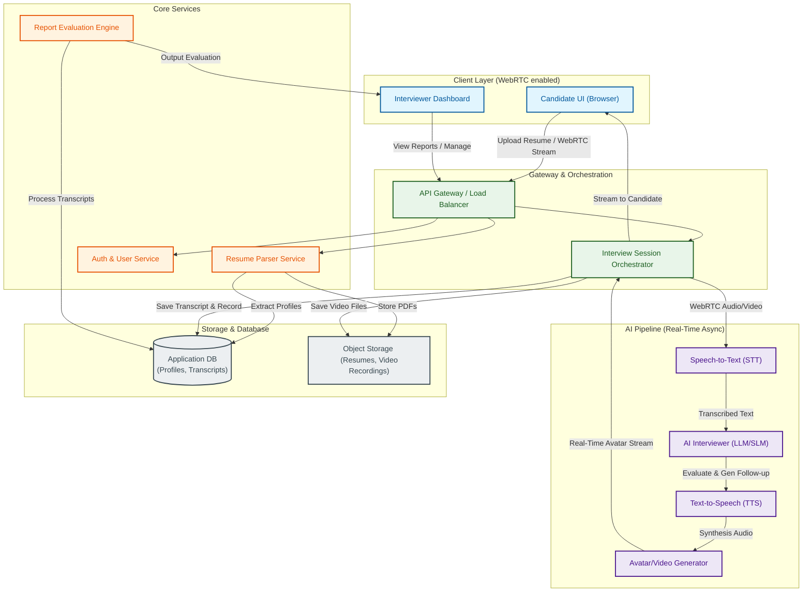
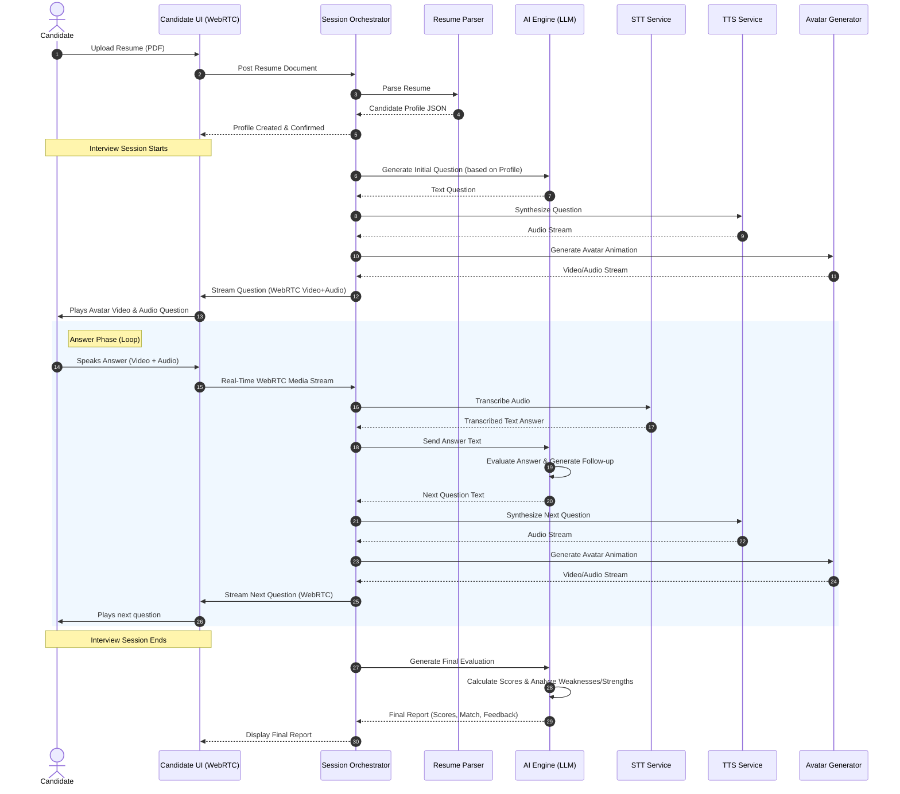

# 🤖 AI Interview Platform

An advanced, real-time AI-powered technical and communication interview platform. The system ingests candidate resumes, conducts interactive voice-and-video interviews using dynamic AI avatars, evaluates responses in real-time, and generates multi-dimensional performance reports.

---

## 🏗️ System Architecture

The following diagram illustrates the high-level system architecture, from client interaction to backend services and the real-time AI pipeline.

---

## 🔄 Interactive Interview Flow

The interview process operates in a closed-loop system powered by WebRTC for low latency communication. The candidate interacts directly with a speaking AI avatar that dynamically changes its questions based on candidate answers and profile context.

---

## 🧩 Component Breakdown

### 1. Resume Parser & Profiler
- **Ingestion**: Accepts PDF format resumes from the Candidate UI.
- **Parsing Engine**: Extracts skills, experience timeline, education, and domain expertise.
- **Output**: Generates a standardized Candidate Profile schema stored in the Database to prime the AI Interviewer.

### 2. Live WebRTC Orchestration
- **Low-Latency Streaming**: Manages real-time audio and video ingestion from the candidate's camera and microphone.
- **Signaling**: Connects and manages WebRTC peers.
- **Broadcasting**: Streams generated AI avatar responses back to the candidate's browser with minimal delay.

### 3. Real-Time AI Pipeline
- **Speech-To-Text (STT)**: Transcribes incoming audio streams to text in real-time.
- **Language Models (LLM/SLM)**: 
  - Evaluates the answers based on technical correctness and depth.
  - Dynamically synthesizes custom follow-up questions tailored to the candidate's response.
- **Text-To-Speech (TTS)**: Translates LLM generated follow-up text questions back to lifelike voice audio.
- **Avatar/Video Generator**: Drives a photorealistic digital avatar with lip-synchronization aligned with the synthetic voice audio.

### 4. Evaluation & Reporting
At the end of the session, the platform aggregates all data points to compile a **Final Candidate Report** containing:
- **Technical Score**: Assessment of programming, architectural, and domain knowledge.
- **Communication Score**: Evaluation of clarity, structure, and speaking pace.
- **Confidence Level**: Behavioral indicators analyzed during the interview.
- **Resume Match**: Similarity index between candidate answers/claims and the parsed resume data.
- **Detailed Feedback**: Categorized breakdown of the candidate's **Strengths** and **Weaknesses**.